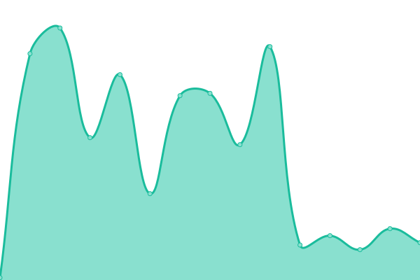

# [📈 Live Status](https://stery-server.ml): <!--live status--> **🟥 Complete outage**

This repository contains the open-source uptime monitor and status page for [AintGotHaters](https://stery-server.ml), powered by [Upptime](https://github.com/upptime/upptime).

With [Upptime](https://upptime.js.org), you can get your own unlimited and free uptime monitor and status page, powered entirely by a GitHub repository. We use [Issues](https://github.com/bystrokr/steryservers/issues) as incident reports, [Actions](https://github.com/bystrokr/steryservers/actions) as uptime monitors, and [Pages](https://stery-server.ml) for the status page.

<!--start: status pages-->
<!-- This summary is generated by Upptime (https://github.com/upptime/upptime) -->
<!-- Do not edit this manually, your changes will be overwritten -->
<!-- prettier-ignore -->
| URL | Status | History | Response Time | Uptime |
| --- | ------ | ------- | ------------- | ------ |
|  STERY PRINCIPAL | Caído | [stery-principal.yml](https://github.com/bystrokr/steryservrs/commits/HEAD/history/stery-principal.yml) | 

 95ms
     
 | 

<a href="https://stery-server.ml/history/stery-principal">99.97%</a>
    

|  STERY CC Checker | Caído | [stery-cc-checker.yml](https://github.com/bystrokr/steryservrs/commits/HEAD/history/stery-cc-checker.yml) | 

 98ms
     
 | 

<a href="https://stery-server.ml/history/stery-cc-checker">31.90%</a>
    

|  STERY CCGEN | Caído | [stery-ccgen.yml](https://github.com/bystrokr/steryservrs/commits/HEAD/history/stery-ccgen.yml) | 

 89ms
     
 | 

<a href="https://stery-server.ml/history/stery-ccgen">31.90%</a>
    

|  STERY GMAIL GEN | Caído | [stery-gmail-gen.yml](https://github.com/bystrokr/steryservrs/commits/HEAD/history/stery-gmail-gen.yml) | 

 60ms
     
 | 

<a href="https://stery-server.ml/history/stery-gmail-gen">31.90%</a>
    

|  STERY BOSSMAIL | Caído | [stery-bossmail.yml](https://github.com/bystrokr/steryservrs/commits/HEAD/history/stery-bossmail.yml) | 

 250ms
     
 | 

<a href="https://stery-server.ml/history/stery-bossmail">31.90%</a>
    

<!--end: status pages-->

[**Visit our status website →**](https://stery-server.ml)

## 📄 License

- Powered by: [Upptime](https://github.com/upptime/upptime)
- Code: [MIT](./LICENSE) © [AintGotHaters](https://stery-server.ml)
- Data in the `./history` directory: [Open Database License](https://opendatacommons.org/licenses/odbl/1-0/)
